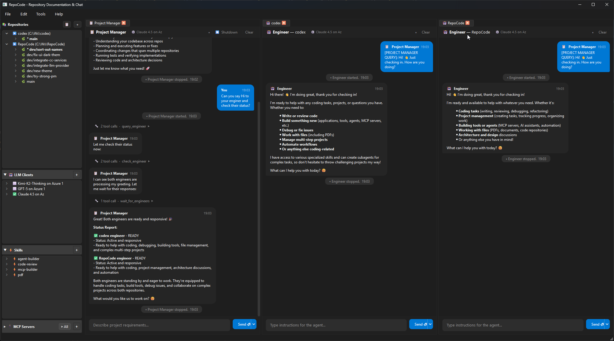

<p align="center">
  <h1 align="center">RepoPilot</h1>
  <p align="center"><strong>AI-powered coding agent that lives in your desktop</strong></p>
  <p align="center">
    Explore, understand, and transform any codebase — backed by the LLM of your choice.
  </p>
</p>

---

## Overview

**RepoPilot** is a native desktop application (PySide6 / Qt) that pairs autonomous AI engineering agents with your local repositories. Point it at a repo, pick an LLM, and start a conversation — or let the built-in engineer agent read, write, and refactor code on your behalf.



## Key Features

| Feature | Description |
|---|---|
| **Multi-repo workspace** | Register multiple repositories and switch between them instantly |
| **Engineer Agent** | Autonomous coding agent that reads, edits, and creates files inside your repo |
| **Project Manager** | High-level planning agent that coordinates tasks across repositories |
| **Bring Your Own LLM** | Azure OpenAI (GPT-4o / GPT-5 / Codex), Anthropic Claude, Kimi K2, and more |
| **MCP Servers** | Extend agent capabilities with Model Context Protocol tool servers |
| **Custom Skills** | Drop in SKILL.md files to teach agents domain-specific knowledge |
| **Split-view Tabs** | VS Code-style grid layout — drag, drop, and split conversations freely |
| **Fully Local** | No cloud relay. LLM calls go directly from your machine to the provider API |

## Getting Started

### Prerequisites

- Python 3.11+
- An API key for at least one supported LLM provider

### Installation

```bash
# Clone the repository
git clone <repo-url> && cd RepoPilot

# Install dependencies
pip install -r requirements-client.txt

# Launch
python -m client.main
```

### Quick Start

1. **Add a repository** — click **+** in the Repositories panel and select a folder.
2. **Configure an LLM** — click **+** in the LLM Clients panel and enter your provider credentials.
3. **Start the engineer** — right-click the repo and choose *Start Engineer*.
4. **Chat** — ask the agent to explain, refactor, or extend your code.

## Architecture

```
RepoPilot
├── client/          # PySide6 Qt frontend
│   ├── ui/          #   Widgets, dialogs, tab system
│   └── main.py      #   Application entry point
├── core/            # Business logic (no Qt dependency)
│   ├── engineer_manager/   # Autonomous coding agent
│   ├── project_manager/    # Planning & coordination agent
│   ├── LLMClients/         # LLM provider adapters
│   ├── mcp/                # MCP server integration
│   ├── skills/             # Skill registry & loader
│   └── events/             # In-process event bus
├── scripts/         # Build & packaging helpers
└── config.json      # Persisted user configuration
```

## Keyboard Shortcuts

| Shortcut | Action |
|---|---|
| `Ctrl+W` | Close current tab |
| `Ctrl+F` | Find in conversation |
| `Ctrl+,` | Preferences |
| `F12` | Toggle debug panel |
| `Ctrl+Q` | Quit |

## License

© 2026 RepoPilot Contributors. All rights reserved.